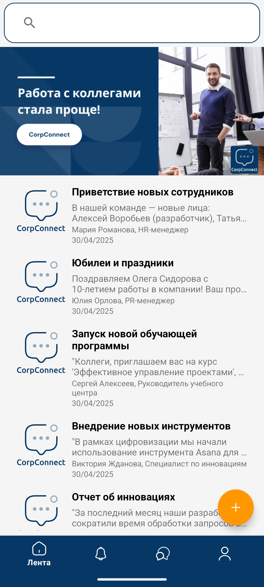
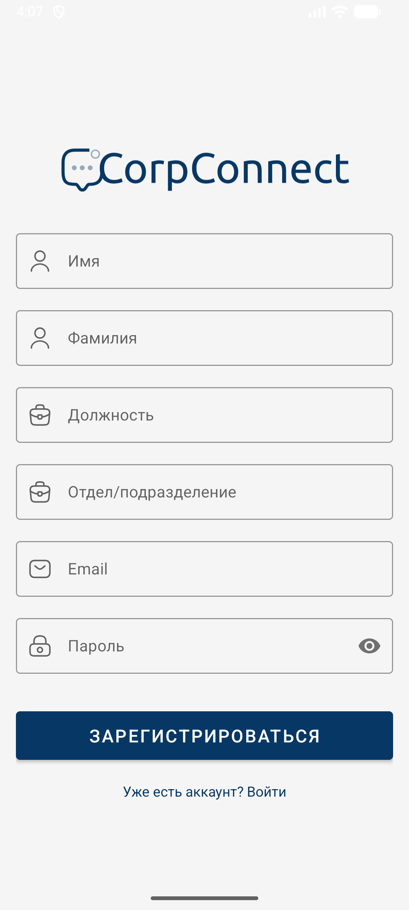
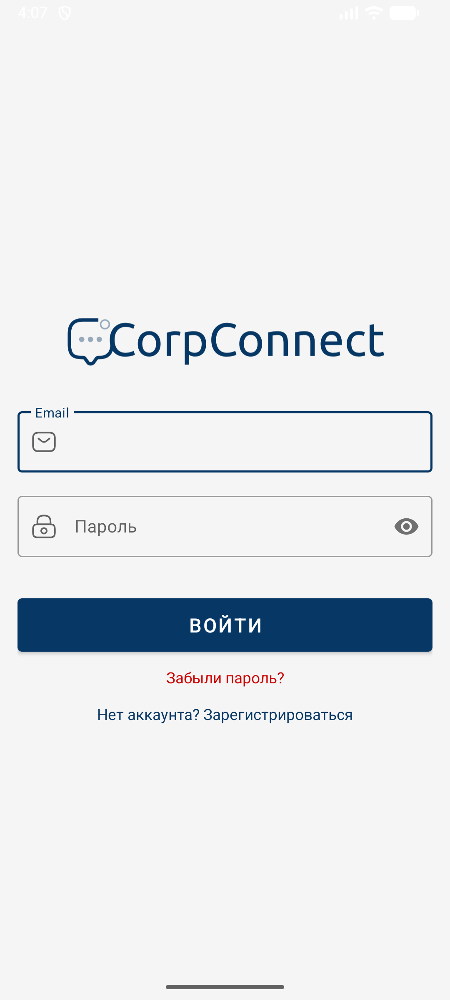
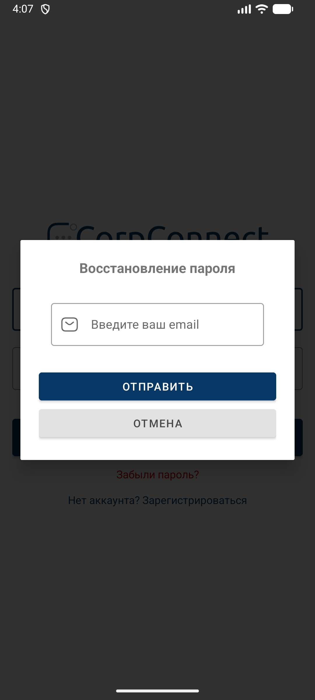
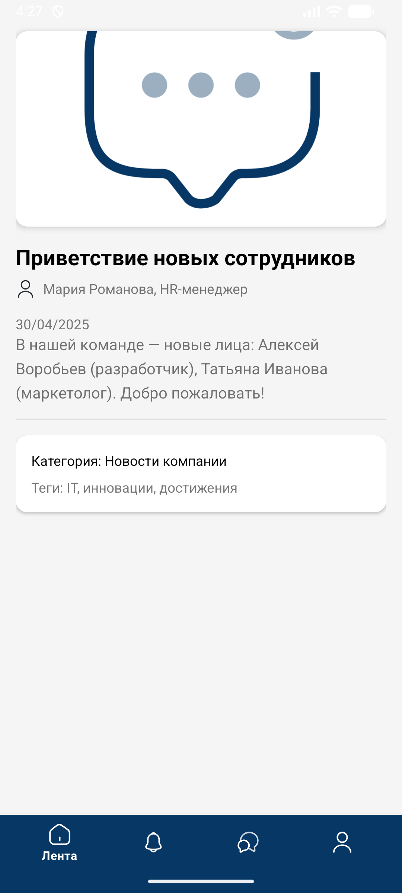
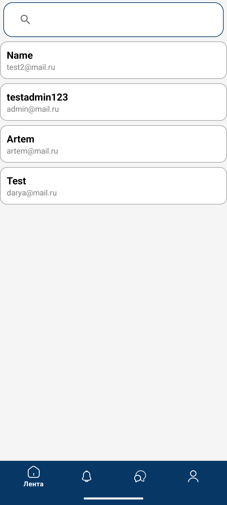
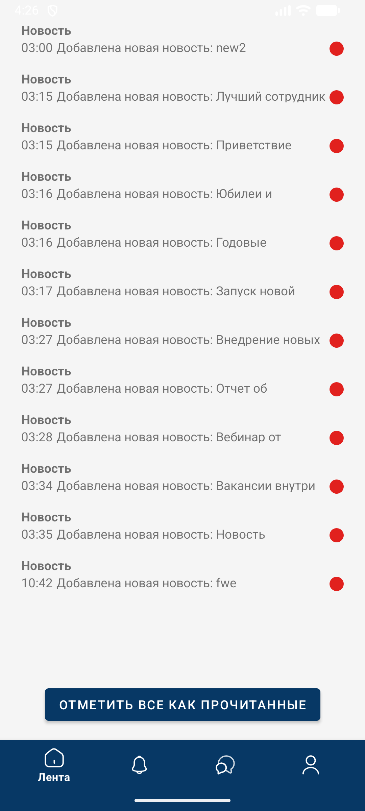
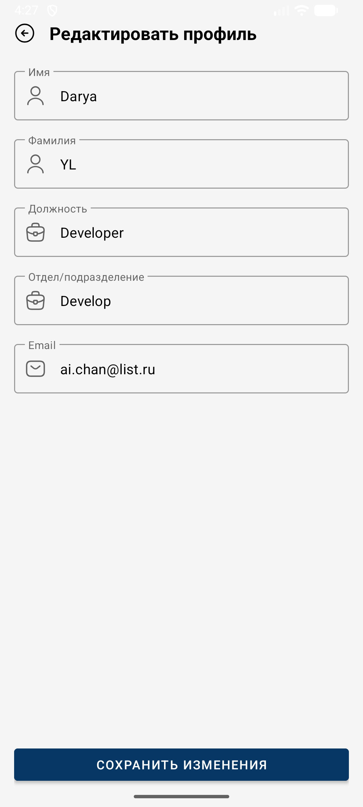
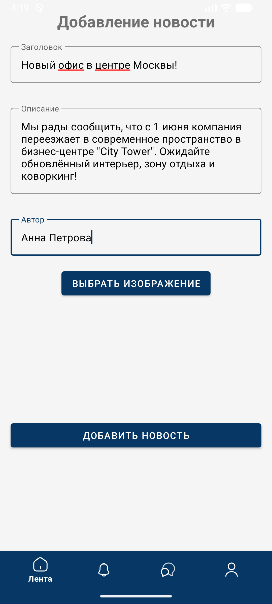

# 🏢 CorpConnect — Корпоративный портал вашей компании

Мобильное приложение для внутренних коммуникаций: читайте новости, общайтесь с коллегами, получайте уведомления и управляйте профилем — всё в одном месте, с авторизацией через Firebase.



---

## 🌟 Основные возможности

- 🔐 **Авторизация и регистрация** через Firebase Authentication
- 📰 **Лента новостей компании** с изображениями, поиском и возможностью удаления (только для администраторов)
- 💬 **Чаты 1 на 1** между сотрудниками с мгновенной отправкой сообщений
- 🔔 **Уведомления** о новых новостях и сообщениях
- 👤 **Профиль пользователя** с именем, должностью, отделом и email
- ✏️ **Редактирование профиля** (для всех пользователей)
- 🛠 **Панель администратора**: добавление новостей с загрузкой изображений
- 🔍 **Поиск сотрудников** по имени

---

## 🛠 Технологии и архитектура

- **Язык**: Java (Android)
- **Архитектура**: Activity-based, Bottom Navigation
- **UI**: Material Design, RecyclerView, ViewPager2, SearchView, FloatingActionButton
- **Аутентификация**: Firebase Authentication
- **База данных**: Firebase Realtime Database (Europe-West1)
- **Загрузка изображений**: Glide + локальное кэширование
- **Хранение данных**: `Serializable` для передачи между Activity
- **Библиотеки**:
    - `com.google.firebase:firebase-auth`
    - `com.google.firebase:firebase-database`
    - `com.github.bumptech.glide:glide`
    - `androidx.recyclerview:recyclerview`
    - `androidx.viewpager2:viewpager2`

---

## 🗂 Структура проекта
```
com.company.corpconnect/
├── adapter/
│ ├── ChatAdapter.java → Чат с разделением на входящие/исходящие
│ ├── ImageBannerAdapter.java → Автоматический баннер на главной
│ ├── NewsAdapter.java → Список новостей
│ ├── NotificationAdapter.java → Уведомления с отметкой прочтения
│ └── UserSearchAdapter.java → Список сотрудников
├── model/
│ ├── Chat.java
│ ├── Message.java
│ ├── News.java
│ ├── Notification.java
│ └── User.java
├── ui/
│ ├── splash/SplashActivity.java
│ ├── login/LoginActivity.java
│ ├── registration/RegisterActivity.java
│ ├── home/
│ │ ├── HomeActivity.java → Главная страница с новостями
│ │ └── NewsDetailActivity.java → Детали новости
│ ├── account/
│ │ ├── AccountActivity.java → Профиль текущего пользователя
│ │ ├── EditProfileActivity.java → Редактирование профиля
│ │ ├── NotificationsActivity.java
│ │ └── UserProfileActivity.java → Профиль другого сотрудника
│ ├── admin/
│ │ └── AddNewsActivity.java → Добавление новостей (админка)
│ └── interaction/
│ ├── ChatsActivity.java → Список коллег для чата
│ └── ChatActivity.java → Окно переписки
```

---

## 🔐 Роли пользователей

- **Обычный пользователь**:
    - Может читать новости, писать в чат, редактировать свой профиль
- **Администратор** (`role = "admin"` в Firebase):
    - Может **удалять любые новости**
    - Видит **кнопку «+»** на главной для публикации новых материалов

> ⚠️ Роль назначается вручную в Firebase Realtime Database.

---

## 📦 Firebase Realtime Database

Структура данных:

```
{
  "users": {
    "user_id_123": {
      "email": "user@company.com",
      "name": "Иван",
      "surname": "Петров",
      "position": "Разработчик",
      "department": "IT",
      "role": "user"
    }
  },
  "news": { ... },
  "chats": { ... },
  "notifications": { ... }
}
```

---

## 📸 Скриншоты приложения

| Экран | Изображение                                                                                          |
|-------|------------------------------------------------------------------------------------------------------|
| **Страница регистрации** |                     |
| **Страница авторизации** |                            |
| **Модальное окно восстановления пароля** |  |
| **Главная страница (новости)** |                                 |
| **Детали новости** |                           |
| **Чат с другим пользователем** |       |
| **Список чатов** |                                    |
| **Уведомления** |                             |
| **Профиль пользователя** |                   |
| **Добавление новости (для админа)** |                           |
